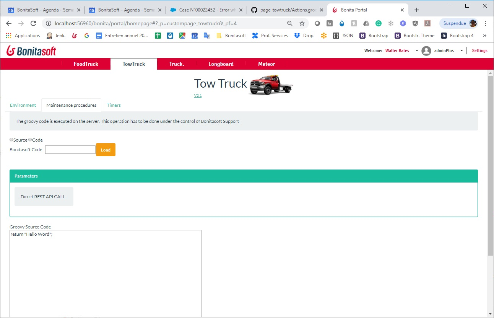

# page_towtruck
The page is use to repair data in engine, like when some timer are broken, to create them again

Use a Code:

Support may give you a Code. Then go to the page, give the code, and execute it.

Develop a new script:

Any script has be be saved under the GroovyMaintenance folder, in the Git Community (<https://github.com/Bonitasoft-Community/page_towtruck/tree/master/GroovyMaintenance>). The file name must be <Name>.groovy. Then the file name is the code to give (case sensitive).
Visit <https://github.com/Bonitasoft-Community/page_towtruck/tree/master/GroovyMaintenance/ReadMe>

