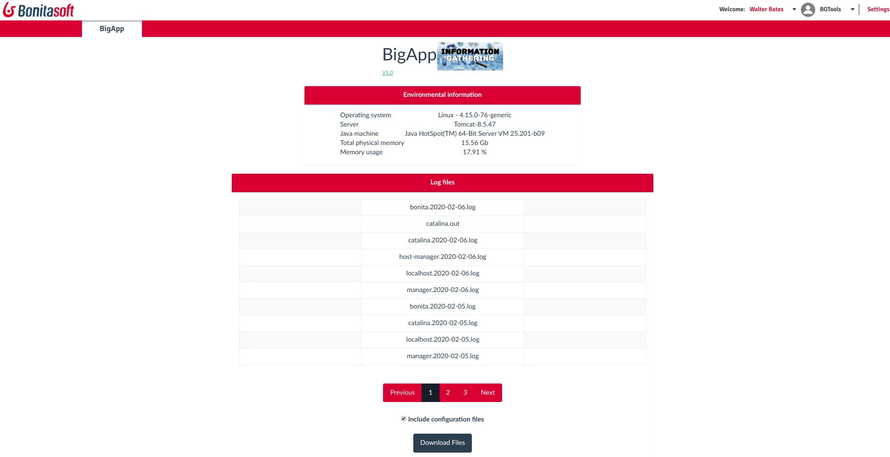

# Bonita Information Gathering Application (BigApp)

This page's main goal is to retrieve information needed (environment information, log files, configuration files) to troubleshoot issues on the product.

# Environment Details:
This section contains general information about the environment where Bonita is used. More information is included in the final Zip file, but only the most relevant ones are displayed on the page.

# Log Files:
This section contains log files that the user could select so they will be added in the final Zip file.

# Setup Configuration:
When the checkbox is enabled a "setup.sh/bat" is performed so the configuration files are added into the final Zip that users can download. When the checkbox is not enabled, only log files and environmental details are included in the final Zip file.

# Download Files:
As its name indicates, this button is responsible for downloading the files needed for Support to troubleshoot issues on the product.
